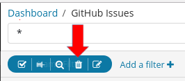
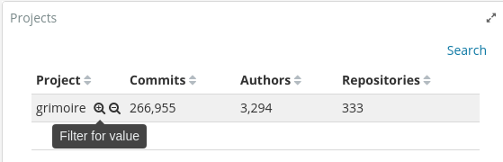
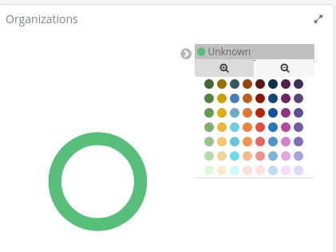

# Sticky Filters

* [Introduction](#introduction)
* [Basic Filter Options](#basic-filter-options)
  * [Enabling/Disabling Filters](#enabling/disabling-filters)
  * [Pinning Filters](#pinning-filters)
  * [Inverting/Negating Filters](#inverting/negating-filters)
  * [Removing Filters](#removing-filters)
  * [Editing Filters](#editing-filters)
* [Interactively Filtering Information](#interactively-filtering-information)
  * [Adding Filters from Tables](#adding-filters-from-tables)
  * [Adding Filters from Pie Charts](#adding-filters-from-pie-charts)
* [Manually Creating Filters](#manually-creating-filters)
* [Advanced Filter Edition](#advanced-filter-edition)

## Introduction
Kibana panels allow user to interactively filtering information. Some filtering
actions will create a filter on top. 

###### Figure 1. Panel filters on top

These filters can also be manually created. Besides, it is possible to pin 
filters to keep them with us when moving to other panels, invert their effect,
enable or disable them.

This document covers the process of filter creation and their basic 
configuration.

## Basic Filter Options

Options will appear when hovering the filter as shown below.

###### Figure 2. Filter Options

#### Enabling/Disabling Filters

###### Figure 3. Enable/Disable Filter

The first icon on the left hand side allows us to enable or disable 
the filter depending on its current state. Just click on the icon to
enable/disable the filter.

A filter is active when its color is not shadowed. A blue filter means
it is active and will filter results that match its specification. Screenshot
below is an example of a filter to get results corresponding to some authors.
Section [Manually Creating Filters](#manually-creating-filters) will show
in detail how this particular filter can be built, now we focus on how to
use it.

###### Figure 4. Active Filter

When a filter is disabled, it will look shadowed as shown below.

###### Figure 5. Disabled Filter

#### Pinning Filters

###### Figure 6. Pin Filter

Sometimes some filters are useful across different panels. If we want to move
to another panel keeping some filters active, we can pin them.
This way the filter will remain on top regardless the panel we are looking at.
When pinned, a small pin icon is shown next to filter label.

###### Figure 7. Pinned Filter

To un-pin the filter, just hover it with mouse pointer and click on pin icon
again.

#### Inverting/Negating Filters

###### Figure 8. Invert/Negate Filter

A filter can be inverted (or negated) by clicking on the magnifying glass icon.
It's easy to identify negated filters because their label shows the word
`NOT` as prefix and their color becomes red.

###### Figure 9. Inverted/Negated Filter

By clicking again on the magnifying glass icon (notice that now it shows a
`+` symbol inside instead of `-`) the filter will come back to its positive
(not negated) state.

#### Removing Filters

###### Figure 10. Remove Filter

Trash icon allow us to completely remove unwanted filters. This action can't
be undone in Kibana, though you can go back in your browser and recover the
filter is needed. This is possible because Kibana stores all filtering
information within page URL (see [Export and Sharing](export_sharing.md) page
for more information on this).

#### Editing Filters

###### Figure 11. Edit Filter

The last icon on the right opens the filter edit window. From there we can
modify filter details and save changes. Please refer to 
[Manually Creating Filters](#manually-creating-filters) or
[Advanced Filter Edition](#advanced-filter-edition) sections for more
information on how to edit filters.

## Interactively Filtering Information

Most of Kibana widgets are not fixed visualizations of data, they are
interactive. Some of them allow to directly create filters by clicking on
the data we are interested in.

#### Adding filters from tables

We can click on table rows to create a specific filter for the information
shown in that row. This action may even create more than one filter, depending
on how rows are splitted. In any case, they are filters after all, so 
they can be modified after being created.

When the mouse pointer hovers a table row, two magnifying glass icons appear
for filtering or filtering out by the corresponding value(s).

###### Figure 12. Filter from table row

###### Figure 13. Filter out data from table row

#### Adding filters from pie charts

Pie charts (or donuts) also allow filter creation. By clicking on the text
of the legend we expand a color picker for choosing slice color. Just below
the text and above color picker, two magnifying glass icons can be used for
filtering or filtering out results corresponding to the given slice. 

###### Figure 14. Panel filter out data from pie legend

There is also a second method to filter data from a pie chart. Just clicking
on the slice we are interested in, we create a filter for that slice.
Using this approach we can't directly create negated filters, this is the main
difference with the above mentioned method. Anyway we can always negate the
filter once it is created on top, as described in 
[Inverting/Negating Filters section](#inverting/negating-filters). 

###### Figure 15. Panel filter out data from pie slice

As may be seen above, when hovering a slice, Kibana shows a tooltip with
the item count corresponding to that group, so we can have a clear idea
of how many items we will visualize data for after filtering.

## Manually Creating Filters

It is possible to manually creating filters to get more specific views of
data. Screenshot below shows a panel showing all information available for
GitHub Issues corresponding to the last 5 years. Clicking on `Add a filter`
on the top left corner we can start filtering data.

###### Figure 16. Creating a filter: add new filter

Then, a new window will appear, allowing us to configure the filter step by
step. First, we need to select the field we wish to use for filtering. A
drop down list will display all available fields. In this example we are
going to choose `author_name` field to get data only for some authors we are
interested in.

###### Figure 17.Creating a filter: select field

Once field is selected, a new drop down list appears allowing us to select the
operator we want to apply. In this case we are selecting `is one of`.

###### Figure 18. Creating a filter: select operator

Now we have the field and the operator, we can specify the names. Again, Kibana
provides a drop down list with all available values for the specified field.
We can select several values as we are using `ìs one of` operator. Just click
on `Values...` field each time you need to add a new value and the drop down
list will come up again.

###### Figure 19. Creating a filter: select values

As shown in the screenshot below, names will appear as rounded boxes that
can be removed by clicking on their `x` icon at their right. Finally we can
set the label of the filter. 

###### Figure 20. Creating a filter: set filter label

After clicking on save, filter will be activated and shown on top with
its label to identify it. Results will be filtered accordingly as shown
in screenshot below. From here, we can use the filter as always.

###### Figure 21. Creating a filter: filter activated

## Advanced Filter Edition

Previous sections introduced different ways of creating filters. Once a
filter is created, we can modify it following the procedure described at
[Editing Filters](#editing-filters) and 
[Manually Creating Filters](#manually-creating-filters) sections. However,
Kibana allow us low level edition if needed. In that case, we will be able
to directly work with 
[DSL queries](https://elasticsearch-dsl.readthedocs.io/en/latest/),
what filters actually are under the hood.

To access to the query of a given filter, we have to edit the filter as
described in [Editing Filters section](#editing-filters) and click on
`Edit Query DSL`

###### Figure 22. Edit Query DSL

This will open the DSL query editor. There we can directly modify the
query to get more complex or specific filtering if needed, or just paste
a query we already have instead of building it again using the 
`Search filter values` interactive editor.

###### Figure 23. DSL Query Editor