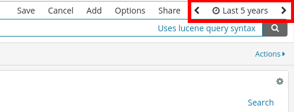
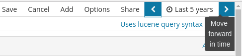
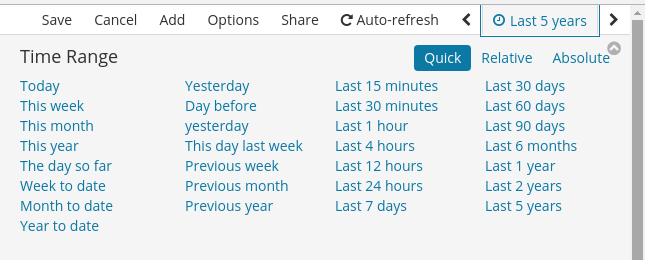
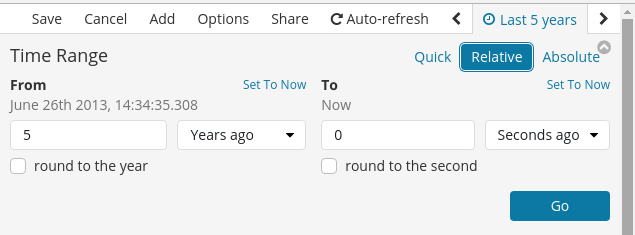
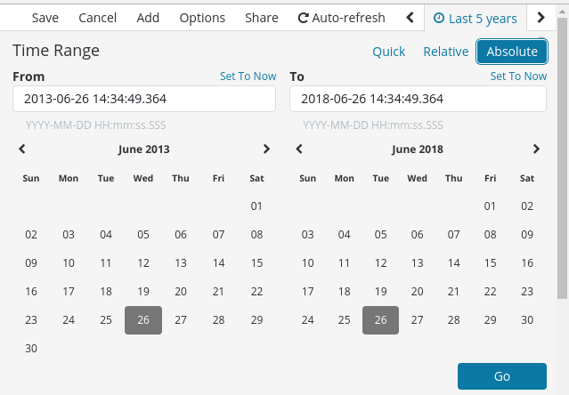

# Time Picker

Most of Bitergia's panels are based on time. They show metrics for a given time
frame. This time frame can be configured using different actions in Kibana,
being the time picker the most explicit one.

Before going into further details about these options, it is important
to know **this time usually refers to item creation date**. If any panel was
based on a different time field, that information would be explicitly mentioned
in the corresponding panel documentation. When nothing is said, we can assume
item creation date is being used.

Time picker is located on the top right corner of the dashboard:

###### Figure 1. Time picker on top right corner

You can **click on the arrows on the sides** to move backwards or forward in time by
equal intervals to the one selected.

###### Figure 2. Time picker: arrows

Or you can **click on the date/time string** to expand all options.
Time picker allows us to select the time range using different approaches
explained in the following sections.

## Quick Mode
This moder allows to quickly select among a set of predefined time ranges.
All of them are pretty self-explanatory as can be seen in the screenshot
below.

###### Figure 3. Time picker: time selection using quick mode

## Relative Mode
This mode allows to set relative dates and round them to the corresponding
time unit, that can also be selected as desired. By default, `To` fields are
set to `Now`. There are also a couple `Set To Now` links in case we need to
set this value for any of the edges of the interval.

###### Figure 4. Time picker: time selection using relative mode

## Absolute Mode
This mode provides us a way of explicitly write the date range we are
interested in. We can directly write the dates down in the text fields or
use the corresponding calendar widget to navigate and set the date.  

###### Figure 5. Time picker: time selection using absolute mode
